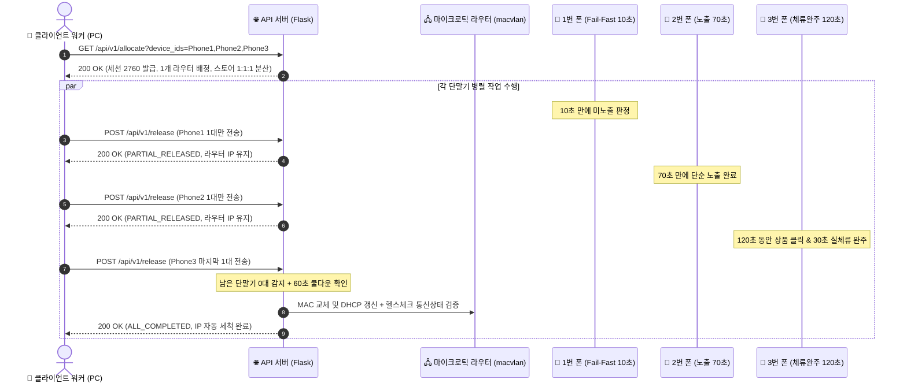

# 📱 Mikrotik Mobile Automation Client API Developer Guide (v2.4)

본 문서는 안드로이드 실단말기(5~60대) 및 클라이언트 자동화 워커가 마이크로틱 라우터 API 서버와 통신하여 **WireGuard VPN 연결, 실전 2~3단어 검색/클릭 작업 수행, NNB/NAPP_DI/GPS 식별자 추출, 120개 온디바이스 프로필 풀 누적, 단말기 1대씩 즉시 개별 반납, 4중 무지성 토글 방지 및 세션 반납**을 수행하는 최신 표준 연동 가이드입니다.

---

## 📌 1. 핵심 아키텍처 및 통신 원칙

1. **배치 할당 (Batch Allocation)**:
   * 클라이언트는 단말기 1대씩 개별 호출하지 않고, **PC에 연결된 단말기 N대(`R3CR70KAZDM,R3CR70SZ0JJ,...`)를 묶어서 1회 API 호출로 일괄 할당**받습니다.
2. **단일 라우터 / 단일 공인 IP 공유**:
   * 한 번의 배치 호출에 1개의 마이크로틱 라우터(가상 WAN `macvlan1`)가 배정되며, 요청된 N대의 단말기는 해당 라우터의 서로 다른 가상 IP(`10.8.0.2`, `10.8.0.3`...)를 통해 **동일한 통신사 공인 IP를 공유**합니다.
3. **동일 IP 내 스토어 중복 배정 원천 차단**:
   * 같은 공인 IP 대역에서 동일한 스토어의 상품이 중복 배정되지 않습니다 (스토어 3분할 1:1:1 격리).
   * 작업할 스토어가 부족한 경우 남은 단말기는 **`job_type: "NO_TASK"`** 로 반환되며, 해당 단말기는 VPN을 켜지 않고 대기합니다.
4. **단말기 1대씩 즉시 개별 반납 (Per-Device Fast Release)**:
   * 각 단말기마다 작업 소요시간(10초~120초)이 다르므로, **작업이 끝난 단말기는 다른 단말기를 기다리지 않고 즉시 1대씩 개별 반납(`POST /api/v1/release`)**합니다.
   * 조기 실패(Fail-Fast)한 단말기는 10초 만에 즉시 풀려나 충전/대기하며 단말기 처리량이 50% 이상 향상됩니다.
5. **서버 4중 지능형 무지성 토글 방지 & 헬스체크 안전장치**:
   * **[안전장치 1] 전원 완주 감지**: 세션 내 다른 단말기가 작업 중(`remaining_working > 0`)일 때는 **라우터 공인 IP를 절대 끊지 않고 유지**합니다.
   * **[안전장치 2] 60초 토글 쿨다운 보호**: 직전 토글로부터 60초가 지나지 않았다면 모뎀 과부하/DHCP 플러딩을 방지하기 위해 중복 토글을 자동 차단합니다.
   * **[안전장치 3] 180초 세션 고아 회수**: 단말기 통신 두절 시 180초 후 워치독이 피어 회수 및 IP 세척을 단행합니다.
   * **[안전장치 4] 토글 후 100% 통신상태 자체 검증**: RouterOS REST API를 통해 신규 공인 IP 획득(`bound`) 및 라우팅 테이블 동기화, 하트비트 정상 수신이 확인된 라우터만 다음 할당에 투입합니다.
6. **120개 온디바이스 프로필 풀 자동 누적 (`pf_{단말기ID}_{0001~0120}`)**:
   * 단말기마다 고유 시퀀스 번호의 프로필(`.tar.gz`)을 발급받아 `/data/local/tmp/profile_storage/`에 저장 및 복원합니다.
   * 신규 프로필은 15분간 `AGING` 후 `READY`로 승격되어 최대 120개까지 차곡차곡 누적됩니다.
7. **24시간 미노출 키워드 자동 재활용 (24h Recycling)**:
   * 2회 연속 미노출로 강등된 `DEGRADED` 키워드는 24시간 후 랭킹 변동을 반영하여 자동으로 `ACTIVE`로 재활성화 및 재검증됩니다.

---

## 📡 2. API 규격 상세

* **Base URL**: `http://114.207.112.173:5000` (또는 `https://aaa4.kr`)
* **데이터 포맷**: `JSON` (`Content-Type: application/json`)

---

### [API 1] 작업 및 WireGuard 일괄 할당 (`GET/POST /api/v1/allocate`)

PC에 연결된 단말기 ID 목록을 전달하여 작업 및 VPN 접속 정보를 일괄 발급받습니다.

#### 🔹 요청 (Request)
* **Method**: `GET` 또는 `POST`
* **Path**: `/api/v1/allocate`
* **Query / Body Parameters**:

| 파라미터명 | 타입 | 필수 | 기본값 | 설명 |
| :--- | :---: | :---: | :---: | :--- |
| **`device_ids`** | String / Array | **필수** | `""` | 배터리 20% 이상인 가용 단말기 ID 목록 (콤마 구분 문자열 또는 JSON 배열)<br/>예: `"R3CR70KAZDM,R3CR70SZ0JJ,R3CRB0WCGET"` |
| **`mode`** | String | 선택 | `"single"` | `"single"` (단일 라우터 공유) / `"multi"` (다중 라우터 분산) |

#### 🔹 요청 예시
```http
GET /api/v1/allocate?device_ids=R3CR70KAZDM,R3CR70SZ0JJ,R3CRB0WCGET,R5CR713T5WT,R5CR9336DSB HTTP/1.1
Host: 114.207.112.173:5000
```

#### 🔹 응답 예시 (Response JSON)
```jsonc
{
  "status": "success",                 // API 요청 성공 상태 ("success" / "error")
  "alloc_id": "2760",                  // 세션 고유 식별자 (작업 완료 후 release 시 필수 전송)
  "router": {                          // 단말기들이 공용으로 사용할 마이크로틱 가상 라우터
    "router_num": "008",               // 배정된 라우터 번호 (예: 008번)
    "endpoint": "221.163.54.24:45820", // WireGuard 서버 접속 공인 IP 및 포트
    "macvlan_ip": "125.130.247.245",   // 라우터의 현재 Egress 공인 IP (통신사 모뎀 IP)
    "server_public_key": "si9407EffGLzEbcWCodH7tp1KR4eUE2MjeoBU0nqgWk=" // WireGuard 서버 공개키
  },
  "tasks": [                           // 요청된 단말기별 작업 지시 배열
    {
      "device_id": "R3CR70KAZDM",      // 작업을 수행할 단말기 고유 ID
      "ip": "10.8.0.2",                // 단말기에 할당된 WireGuard 가상 내부 IP
      "private_key": "ONIEwF4JU4tzAW/p...", // 단말기용 WireGuard 개인키
      "mid": "91281269728",            // [핵심] 네이버 쇼핑 타겟 상품 고유 MID
      "keyword": "경량 런닝 베스트",     // [핵심] 네이버 검색창에 입력할 실전 키워드
      "product_title": "카인드 러닝조끼 경량 러닝 팩...", // 상품 원본 제목 (화면 대조용)
      "allow_click": true,             // [클릭 허용 여부] true: 타겟 상품 클릭 & 30초 실체류 / false: 노출만 검수
      "job_type": "GOLDEN_CLICK",      // [작업 유형] GOLDEN_CLICK(클릭), GOLDEN_EXPOSURE(노출), SCOUT_DISCOVER(탐색), NO_TASK(대기)
      "profile": {                     // [온디바이스 프로필 정보]
        "profile_id": 733,             // 서버 DB 프로필 고유 ID
        "profile_name": "pf_R3CR70KAZDM_0004", // 120개 풀 순차 프로필 명칭
        "snapshot_path": "/data/local/tmp/profile_storage/pf_R3CR70KAZDM_0004.tar.gz", // 단말기 내 tar.gz 경로
        "ssaid": "24f87d74f870d9ff",   // 복원할 Android ID (신규 시 null)
        "adid": "d5856be0-4aa9-712b-8a12-98476d0b16c1"
      }
    },
    {
      "device_id": "R3CR70SZ0JJ",
      "ip": "10.8.0.3",
      "private_key": "6Cl0ROVXfDFV+J...",
      "mid": "91281472643",
      "keyword": "gold finger 휴대용 비닐",
      "product_title": "휴대용 감자칩 비스킷백용...",
      "allow_click": false,
      "job_type": "SCOUT_DISCOVER",    // 신규 프로필 생성 및 노출 탐색
      "profile": {
        "profile_id": 0,
        "profile_name": "pf_R3CR70SZ0JJ_0008",
        "snapshot_path": "/data/local/tmp/profile_storage/pf_R3CR70SZ0JJ_0008.tar.gz",
        "ssaid": null
      }
    },
    {
      "device_id": "R5CR713T5WT",
      "ip": null,                      // NO_TASK 단말기는 IP 미할당
      "private_key": null,
      "mid": null,
      "keyword": null,
      "product_title": null,
      "allow_click": false,
      "job_type": "NO_TASK",           // 스토어 중복 방지로 인해 대기 (VPN 켜지 않음)
      "profile": null
    }
  ]
}
```

---

### [API 2] 작업 완료 및 1대씩 즉시 개별 반납 (`POST /api/v1/release`)

각 단말기 워커가 작업을 마칠 때마다 **해당 단말기 1대만 담아서 즉시 호출**합니다.

#### 🔹 요청 (Request JSON - 1대 개별 반납 표준)
* **Method**: `POST`
* **Path**: `/api/v1/release`

```jsonc
{
  "alloc_id": "2760",                  // [필수] 할당받았던 세션 ID
  "results": [                         // [필수] 방금 끝난 단말기 1대 결과 전송
    {
      "device_id": "R3CR70KAZDM",      // [필수] 대상 단말기 ID
      "status": "SUCCESS",             // [필수] 작업 완료 상태 ("SUCCESS", "FAILED")
      "target_code": "91281269728",    // [선택] 대상 상품 MID
      "keyword": "경량 런닝 베스트",     // [선택] 검색 키워드
      "is_searched": true,             // [필수] 검색창 입력 및 검색 실행 여부
      "is_clicked": true,              // [필수] 타겟 상품 클릭 & 상세페이지 30초 실체류 완주 여부
      "is_exposed": true,              // [필수] 검색 결과 뷰포트 내 타겟 상품 발견 여부
      "exposure_rank": 1,              // [선택] 검색 결과 노출 순위 (1위, 2위... 미노출 시 null)
      "execution_sec": 95.8,          // [권장] 작업 시작부터 완료/종료까지의 사이클 총 진행 시간(초)
      "battery_level": 78.45,          // [권장] 단말기 최종 배터리 잔량 (소수점 2자리 Float, 0.00~100.00 %, 서버 단순 기록용)
      "free_storage_mb": 11250,        // [선택] 단말기 내부 파티션 남은 저장 공간(MB)
      "gps_lat": 37.497942,            // [권장] 주입된 Mock GPS 위도
      "gps_lng": 127.027621,           // [권장] 주입된 Mock GPS 경도
      "ssaid": "24f87d74f870d9ff",     // [권장] 주입된 Android ID (SSAID)
      "adid": "d5856be0-4aa9-712b-8a12-98476d0b16c1",
      "nnb": "2XCZFDQZSGJWU",          // [핵심] 네이버 웹뷰에서 추출된 실제 NNB 쿠키값
      "napp_di": "d30a1cebce25e16bdc3a4c318f4a185f", // [핵심] 네이버 앱 NAPP_DI 식별값
      "snapshot_path": "/data/local/tmp/profile_storage/pf_R3CR70KAZDM_0004.tar.gz" // 저장된 프로필 경로
    }
  ]
}
```

#### 🔹 서버 응답 분기 (서버의 지능형 라우터 보호)

##### [Case 1] 일부 단말기 먼저 반납 시 (`session_state: "PARTIAL_RELEASED"`)
> 💡 다른 단말기들이 작업 중이므로 라우터 공인 IP를 절대 끊지 않고 유지합니다 (`toggled_routers: []`).

```jsonc
{
  "status": "success",
  "session_state": "PARTIAL_RELEASED",
  "is_session_closed": false,
  "alloc_id": "2760",
  "remaining_working": 3,              // 아직 작업 중인 단말기가 3대 남아있음
  "processed_devices": ["R3CR70KAZDM"],
  "toggled_routers": [],               // 라우터 IP 보호 (변경하지 않음)
  "message": "세션 [2760] 조기 반납 접수 완료 (진행 중인 단말기 3대 존재로 라우터 IP 유지)"
}
```

##### [Case 2] 마지막 단말기까지 전원 완주 반납 시 (`session_state: "ALL_COMPLETED"`)
> 💡 모든 단말기가 끝났음을 감지하고, 60초 쿨다운 확인 후 라우터 공인 IP를 안전하게 1회 자동 세척합니다.

```jsonc
{
  "status": "success",
  "session_state": "ALL_COMPLETED",
  "is_session_closed": true,
  "alloc_id": "2760",
  "remaining_working": 0,              // 남은 단말기 0대 (세션 완전 종료)
  "processed_devices": ["R5CR9336DSB"],
  "toggled_routers": ["008"],          // 공인 IP가 성공적으로 세척된 라우터 목록
  "message": "세션 [2760] 전원 완주 반납 완료 및 사용 라우터 ['008'] VPN IP 자동 토글 실행"
}
```

---

## 🔒 3. 클라이언트 WireGuard 설정 조립 가이드

클라이언트는 API 응답값과 아래 **고정 기본값(Static Defaults)** 을 결합하여 WireGuard 터널을 생성합니다.

### 📌 클라이언트 하드코딩 고정값
* **`DNS`**: `8.8.8.8, 1.1.1.1`
* **`AllowedIPs`**: `0.0.0.0/0` (전체 트래픽 터널링)
* **`MTU`**: `1420`
* **`PersistentKeepalive`**: `25`
* **서브넷 마스크**: `/32`

### 🛠️ 설정 텍스트 조합 예시
```ini
[Interface]
PrivateKey = {task.private_key}
Address = {task.ip}/32
DNS = 8.8.8.8, 1.1.1.1
MTU = 1420

[Peer]
PublicKey = {router.server_public_key}
Endpoint = {router.endpoint}
AllowedIPs = 0.0.0.0/0
PersistentKeepalive = 25
```

---

## 🔄 4. 단말기 1대씩 즉시 개별 반납 생명주기 (Lifecycle Flow)



---

## 💻 5. 클라이언트 표준 참조 구현 코드 (Python 스레드풀 기반 1대씩 즉시 반납)

```python
import requests
import json
import time
from concurrent.futures import ThreadPoolExecutor

API_BASE = "http://114.207.112.173:5000"
ALL_DEVICES = ["R3CR70KAZDM", "R3CR70SZ0JJ", "R3CRB0WCGET", "R5CR713T5WT", "R5CR9336DSB"]

def get_device_battery(device_id):
    """단말기 배터리 잔량 조회 (ADB dumpsys battery)"""
    return 75  # 예시: 75%

def run_single_device_worker(alloc_id, task):
    """
    [단말기 1대 전담 워커]
    작업이 끝나는 즉시 다른 단말기를 기다리지 않고 1대만 서버에 즉시 반납합니다.
    """
    dev_id = task["device_id"]
    job_type = task["job_type"]

    if job_type == "NO_TASK":
        print(f"  - [{dev_id}] ⏸️ 작업 없음 (NO_TASK) -> 대기")
        return

    t0 = time.time()
    print(f"  - [{dev_id}] 🚀 작업 시작: MID={task['mid']}, 키워드='{task['keyword']}', 클릭허용={task['allow_click']}")

    # 1. 프로필 복원 (task['profile']['snapshot_path'] 존재 시 tar.gz 복원)
    # 2. WireGuard VPN 활성화
    # 3. 네이버 앱 기동 -> 키워드 검색 -> 타겟 MID 탐색
    # 4. allow_click == True인 경우 30초 체류 스크롤
    # 5. NNB, NAPP_DI 식별자 추출 및 프로필 tar.gz 저장
    # (예시 시뮬레이션: 70~120초 소요)
    time.sleep(2)  # 실제 작업 수행

    exec_sec = round(time.time() - t0, 1)
    profile_path = task.get("profile", {}).get("snapshot_path") if task.get("profile") else f"/data/local/tmp/profile_storage/pf_{dev_id}_latest.tar.gz"
    current_battery = get_device_battery(dev_id)

    # -------------------------------------------------------------------------
    # [핵심] 작업 종료 즉시 1대만 담아서 개별 반납!
    # -------------------------------------------------------------------------
    release_payload = {
        "alloc_id": alloc_id,
        "results": [
            {
                "device_id": dev_id,
                "status": "SUCCESS",
                "target_code": task["mid"],
                "keyword": task["keyword"],
                "is_searched": True,
                "is_clicked": task["allow_click"],
                "is_exposed": True,
                "exposure_rank": 1,
                "execution_sec": exec_sec,
                "battery_level": round(current_battery, 2),  # 소수점 2자리 (예: 78.45)
                "free_storage_mb": 11250,
                "gps_lat": 37.497942,
                "gps_lng": 127.027621,
                "ssaid": "24f87d74f870d9ff",
                "adid": "d5856be0-4aa9-712b-8a12-98476d0b16c1",
                "nnb": "2XCZFDQZSGJWU",
                "napp_di": "d30a1cebce25e16bdc3a4c318f4a185f",
                "snapshot_path": profile_path
            }
        ]
    }

    rel_res = requests.post(f"{API_BASE}/api/v1/release", json=release_payload).json()
    print(f"  - [{dev_id}] 🏁 1대 개별 반납 완료: {rel_res.get('message')}")

def run_batch_session():
    # 0. 배터리 20% 이상 가용 단말기 필터링
    ready_devices = [d for d in ALL_DEVICES if get_device_battery(d) >= 20]
    if not ready_devices:
        print("⏸️ 가용 단말기 없음 (충전 대기)")
        return

    # 1. N대 일괄 할당
    url = f"{API_BASE}/api/v1/allocate"
    res = requests.get(url, params={"device_ids": ",".join(ready_devices)}).json()
    if res.get("status") != "success":
        print(f"❌ 할당 실패: {res.get('message')}")
        return

    alloc_id = res["alloc_id"]
    router_info = res["router"]
    tasks = res["tasks"]
    print(f"✅ N대 일괄 할당 성공! [세션 ID: {alloc_id}] 라우터: {router_info['router_num']}")

    # 2. 병렬 스레드풀에서 각 단말기 가동 및 개별 즉시 반납 실행
    with ThreadPoolExecutor(max_workers=len(tasks)) as executor:
        for task in tasks:
            executor.submit(run_single_device_worker, alloc_id, task)

if __name__ == "__main__":
    run_batch_session()
```

---

## ❓ 6. FAQ & 무지성 토글 방지 Q&A

#### Q1. 1대씩 반납하면 라우터 IP가 5번 연속으로 바뀌어 다른 단말기가 끊기지 않나요?
* **답변**: **전혀 끊기지 않습니다.** 서버는 세션에 할당된 단말기들의 진행 상태(`remaining_working`)를 실시간 카운트합니다. 1~4번째 단말기가 반납될 때는 `toggled_routers: []`로 라우터 IP를 100% 안전하게 유지하며, **마지막 5번째 단말기까지 모두 반납되었을 때만 라우터 IP를 딱 1회 교체**합니다.

#### Q2. 5대 중 1대가 10초 만에 끝나고, 나머지 단말기들도 순식간에 끝나면 너무 자주 토글되지 않나요?
* **답변**: **서버의 60초 쿨다운 안전장치가 차단합니다.** 서버는 직전 토글 성공 시점으로부터 60초가 경과하지 않은 라우터의 경우, 세션이 아무리 빨리 끝나도 무지성 토글을 건너뛰어 통신사 모뎀을 과부하로부터 완벽히 보호합니다.

#### Q3. 토글 후 새 IP가 정상인지 어떻게 보장하나요?
* **답변**: 라우터가 MAC을 변경하고 DHCP Release를 수행한 후, RouterOS REST API를 통해 **새 공인 IP가 정상 할당(`status == 'bound'`)되고 기본 게이트웨이 라우팅 테이블이 동기화될 때까지 자체 검증**을 수행합니다. 검증이 통과된 라우터만 다음 할당 풀에 제공됩니다.
