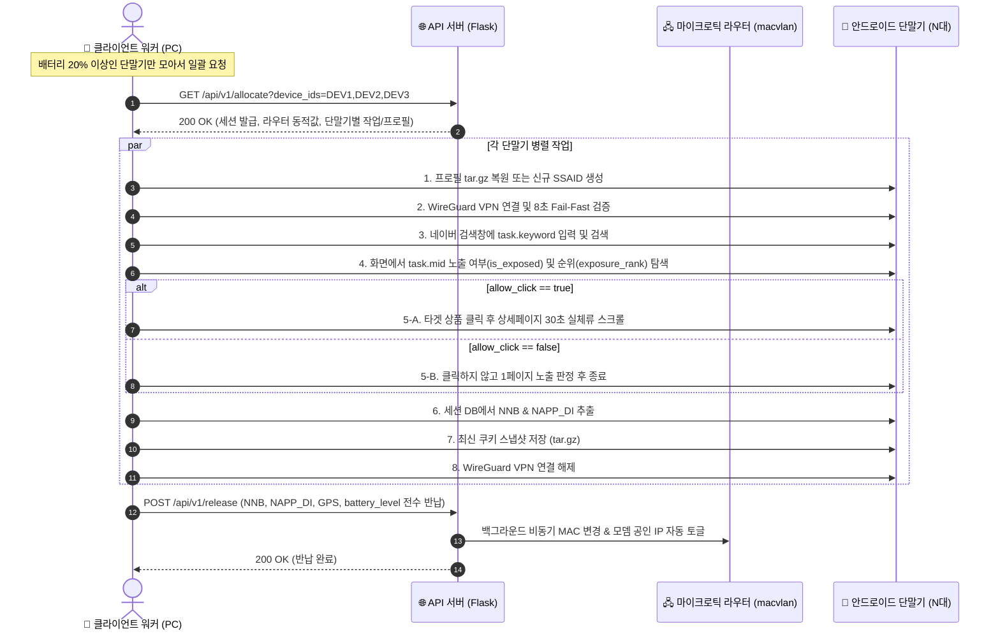

# 📱 Mikrotik Mobile Automation Client API Developer Guide (v2.3)

본 문서는 안드로이드 실단말기(5~60대) 및 클라이언트 자동화 워커가 마이크로틱 라우터 API 서버와 통신하여 **WireGuard VPN 연결, 실전 2~3단어 검색/클릭 작업 수행, NNB/NAPP_DI/GPS 식별자 추출, 120개 온디바이스 프로필 풀 누적, 최종 배터리 잔량(`battery_level`) 보고 및 세션 반납**을 수행하는 최신 표준 연동 가이드입니다.

---

## 📌 1. 핵심 아키텍처 및 통신 원칙

1. **배치 할당 (Batch Allocation)**:
   * 클라이언트는 단말기 1대씩 개별 호출하지 않고, **PC에 연결된 단말기 N대(`R3CR70KAZDM,R3CR70SZ0JJ,...`)를 묶어서 1회 API 호출로 일괄 할당**받습니다.
2. **단일 라우터 / 단일 공인 IP 공유**:
   * 한 번의 배치 호출에 1개의 마이크로틱 라우터(가상 WAN `macvlan1`)가 배정되며, 요청된 N대의 단말기는 해당 라우터의 서로 다른 가상 IP(`10.8.0.2`, `10.8.0.3`...)를 통해 **동일한 통신사 공인 IP를 공유**합니다.
3. **동일 IP 내 스토어 중복 배정 원천 차단**:
   * 같은 공인 IP 대역에서 동일한 스토어의 상품이 중복 배정되지 않습니다 (스토어 3분할 1:1:1 격리).
   * 작업할 스토어가 부족한 경우 남은 단말기는 **`job_type: "NO_TASK"`** 로 반환되며, 해당 단말기는 VPN을 켜지 않고 대기합니다.
4. **단말기 자율 배터리 제어 및 서버 단순 기록 (`battery_level`)**:
   * 클라이언트는 단말기 배터리가 20% 미만인 경우 작업을 요청하지 않고 자체 충전 대기합니다.
   * 작업 완료 후 반납(`POST /api/v1/release`) 시 **현재 배터리 잔량(`battery_level: 78`)을 포함하여 전송하면 서버는 이를 단순 기록 및 대시보드 관제용으로 저장**합니다.
5. **120개 온디바이스 프로필 풀 자동 누적 (`pf_{단말기ID}_{0001~0120}`)**:
   * 단말기마다 고유 시퀀스 번호의 프로필(`.tar.gz`)을 발급받아 `/data/local/tmp/profile_storage/`에 저장 및 복원합니다.
   * 신규 프로필은 15분간 `AGING` 후 `READY`로 승격되어 최대 120개까지 차곡차곡 누적됩니다.
6. **초기 불량 조기 반납 (Fail-Fast Release)**:
   * 5대 중 1대가 캡차 차단/앱 크래시 등으로 10초 만에 실패하더라도, 정상 작업 중인 나머지 단말기들의 통신을 끊지 않고 **실패한 단말기만 즉시 부분 반납(`PARTIAL_RELEASED`)**합니다.
7. **24시간 미노출 키워드 자동 재활용 (24h Recycling)**:
   * 2회 연속 미노출로 강등된 `DEGRADED` 키워드는 24시간 후 랭킹 변동을 반영하여 자동으로 `ACTIVE`로 재활성화 및 재검증됩니다.
8. **반납 시 공인 IP 자동 세척 (Auto-Toggle)**:
   * 세션의 모든 단말기가 완주(`ALL_COMPLETED`)되면, 서버가 백그라운드에서 **해당 라우터의 가상 MAC 주소를 변경하여 통신사 모뎀으로부터 새로운 공인 IP로 즉시 교체**합니다.
9. **3분(180초) 무응답 자동 세척 및 0초 즉시 재할당 (Self-Healing)**:
   * 통신 단절 등으로 3분간 무응답 시 서버 워치독이 피어를 자동 회수합니다.
   * 3분이 지나지 않았더라도 단말기가 다시 할당을 요청하면 **기존 고아 세션을 0초 만에 즉시 풀고 새 작업을 발급**합니다.

---

## 📡 2. API 규격 상세

* **Base URL**: `http://114.207.112.173:5000` (또는 `https://aaa4.kr`)
* **데이터 포맷**: `JSON` (`Content-Type: application/json`)

---

### [API 1] 작업 및 WireGuard 일괄 할당 (`GET/POST /api/v1/allocate`)

PC에 연결된 단말기 ID 목록을 전달하여 작업 및 VPN 접속 정보를 일괄 발급받습니다.

#### 🔹 요청 (Request)
* **Method**: `GET` 또는 `POST`
* **Path**: `/api/v1/allocate`
* **Query / Body Parameters**:

| 파라미터명 | 타입 | 필수 | 기본값 | 설명 |
| :--- | :---: | :---: | :---: | :--- |
| **`device_ids`** | String / Array | **필수** | `""` | 단말기 고유 ID 목록 (콤마 구분 문자열 또는 JSON 배열)<br/>예: `"R3CR70KAZDM,R3CR70SZ0JJ,R3CRB0WCGET"` |
| **`mode`** | String | 선택 | `"single"` | `"single"` (단일 라우터 공유) / `"multi"` (다중 라우터 분산) |

#### 🔹 요청 예시
```http
GET /api/v1/allocate?device_ids=R3CR70KAZDM,R3CR70SZ0JJ,R3CRB0WCGET,R5CR713T5WT,R5CR9336DSB HTTP/1.1
Host: 114.207.112.173:5000
```

#### 🔹 응답 예시 (Response JSON)
```jsonc
{
  "status": "success",                 // API 요청 성공 상태 ("success" / "error")
  "alloc_id": "2760",                  // 세션 고유 식별자 (작업 완료 후 release 시 필수 전송)
  "router": {                          // 단말기들이 공용으로 사용할 마이크로틱 가상 라우터
    "router_num": "008",               // 배정된 라우터 번호 (예: 008번)
    "endpoint": "221.163.54.24:45820", // WireGuard 서버 접속 공인 IP 및 포트
    "macvlan_ip": "125.130.247.245",   // 라우터의 현재 Egress 공인 IP (통신사 모뎀 IP)
    "server_public_key": "si9407EffGLzEbcWCodH7tp1KR4eUE2MjeoBU0nqgWk=" // WireGuard 서버 공개키
  },
  "tasks": [                           // 요청된 단말기별 작업 지시 배열
    {
      "device_id": "R3CR70KAZDM",      // 작업을 수행할 단말기 고유 ID
      "ip": "10.8.0.2",                // 단말기에 할당된 WireGuard 가상 내부 IP
      "private_key": "ONIEwF4JU4tzAW/p...", // 단말기용 WireGuard 개인키
      "mid": "91281269728",            // [핵심] 네이버 쇼핑 타겟 상품 고유 MID
      "keyword": "경량 런닝 베스트",     // [핵심] 네이버 검색창에 입력할 실전 키워드
      "product_title": "카인드 러닝조끼 경량 러닝 팩...", // 상품 원본 제목 (화면 대조용)
      "allow_click": true,             // [클릭 허용 여부] true: 타겟 상품 클릭 & 30초 실체류 / false: 노출만 검수
      "job_type": "GOLDEN_CLICK",      // [작업 유형] GOLDEN_CLICK(클릭), GOLDEN_EXPOSURE(노출), SCOUT_DISCOVER(탐색), NO_TASK(대기)
      "profile": {                     // [온디바이스 프로필 정보]
        "profile_id": 733,             // 서버 DB 프로필 고유 ID
        "profile_name": "pf_R3CR70KAZDM_0004", // 120개 풀 순차 프로필 명칭
        "snapshot_path": "/data/local/tmp/profile_storage/pf_R3CR70KAZDM_0004.tar.gz", // 단말기 내 tar.gz 경로
        "ssaid": "24f87d74f870d9ff",   // 복원할 Android ID (신규 시 null)
        "adid": "d5856be0-4aa9-712b-8a12-98476d0b16c1"
      }
    },
    {
      "device_id": "R3CR70SZ0JJ",
      "ip": "10.8.0.3",
      "private_key": "6Cl0ROVXfDFV+J...",
      "mid": "91281472643",
      "keyword": "gold finger 휴대용 비닐",
      "product_title": "휴대용 감자칩 비스킷백용...",
      "allow_click": false,
      "job_type": "SCOUT_DISCOVER",    // 신규 프로필 생성 및 노출 탐색
      "profile": {
        "profile_id": 0,
        "profile_name": "pf_R3CR70SZ0JJ_0008",
        "snapshot_path": "/data/local/tmp/profile_storage/pf_R3CR70SZ0JJ_0008.tar.gz",
        "ssaid": null
      }
    },
    {
      "device_id": "R5CR713T5WT",
      "ip": null,                      // NO_TASK 단말기는 IP 미할당
      "private_key": null,
      "mid": null,
      "keyword": null,
      "product_title": null,
      "allow_click": false,
      "job_type": "NO_TASK",           // 스토어 중복 방지로 인해 대기 (VPN 켜지 않음)
      "profile": null
    }
  ]
}
```

---

### [API 2] 작업 완료 및 세션 반납 (`POST /api/v1/release`)

작업이 종료된 후 서버에 상세 실행 결과(검색/노출/클릭 여부, 순위, 소요시간, NNB, NAPP_DI, GPS 좌표, 배터리 잔량 등)를 보고하고 세션을 반납합니다.

#### 🔹 요청 (Request JSON)
* **Method**: `POST`
* **Path**: `/api/v1/release`

```jsonc
{
  "alloc_id": "2760",                  // [필수] 할당받았던 세션 ID
  "results": [                         // [필수] 단말기별 실행 결과 리스트
    {
      "device_id": "R3CR70KAZDM",      // [필수] 대상 단말기 ID
      "status": "SUCCESS",             // [필수] 작업 완료 상태 ("SUCCESS", "FAILED")
      "target_code": "91281269728",    // [선택] 대상 상품 MID
      "keyword": "경량 런닝 베스트",     // [선택] 검색 키워드
      "is_searched": true,             // [필수] 검색창 입력 및 검색 실행 여부
      "is_clicked": true,              // [필수] 타겟 상품 클릭 & 상세페이지 30초 실체류 완주 여부
      "is_exposed": true,              // [필수] 검색 결과 뷰포트 내 타겟 상품 발견 여부
      "exposure_rank": 1,              // [선택] 검색 결과 노출 순위 (1위, 2위... 미노출 시 null)
      "execution_sec": 95.8,          // [권장] 작업 시작부터 완료/종료까지의 사이클 총 진행 시간(초)
      "battery_level": 78.5,           // [권장] 단말기 최종 배터리 정밀 잔량 (0~100 %, 소수점 지원)
      "free_storage_mb": 11250,        // [선택] 단말기 내부 파티션 남은 저장 공간(MB)
      "gps_lat": 37.497942,            // [권장] 주입된 Mock GPS 위도
      "gps_lng": 127.027621,           // [권장] 주입된 Mock GPS 경도
      "ssaid": "24f87d74f870d9ff",     // [권장] 주입된 Android ID (SSAID)
      "adid": "d5856be0-4aa9-712b-8a12-98476d0b16c1",
      "nnb": "2XCZFDQZSGJWU",          // [핵심] 네이버 웹뷰에서 추출된 실제 NNB 쿠키값
      "napp_di": "d30a1cebce25e16bdc3a4c318f4a185f", // [핵심] 네이버 앱 NAPP_DI 식별값
      "snapshot_path": "/data/local/tmp/profile_storage/pf_R3CR70KAZDM_0004.tar.gz" // 저장된 프로필 아카이브 경로
    }
  ]
}
```

#### 🔹 반납 파라미터 상세 명세표

| 필드명 | 타입 | 필수 | 설명 |
| :--- | :---: | :---: | :--- |
| **`alloc_id`** | String | **필수** | 할당 시 발급받았던 세션 ID |
| **`device_id`** | String | **필수** | 대상 단말기 ID |
| **`status`** | String | **필수** | **`"SUCCESS"`** (정상 완주) / **`"FAILED"`** (오류 실패) |
| **`battery_level`**| Float / Int | **권장** | **단말기 현재 배터리 정밀 잔량 (0~100 %, 소수점 지원)** |
| **`target_code`** | String | 선택 | 대상 상품 MID |
| **`keyword`** | String | 선택 | 검색 키워드 |
| **`is_searched`** | Bool | **필수** | 검색창 입력 및 검색 실행 완료 여부 (`true`/`false`) |
| **`is_clicked`** | Bool | **필수** | 상품 상세페이지 진입 및 30초 체류 완료 여부 (`true`/`false`) |
| **`is_exposed`** | Bool | **필수** | 검색 결과 내 타겟 상품 발견 여부 (`true`/`false`) |
| **`exposure_rank`**| Int | 선택 | 검색 결과 노출 순위 (1, 2, 3위... 미노출 시 `null`) |
| **`execution_sec`**| Float | **권장** | 사이클 총 진행 시간(초 단위, 예: `95.8`) |
| **`gps_lat`** / **`gps_lng`** | Float | **권장** | 단말기에 스푸핑 적용된 Mock GPS 좌표 |
| **`ssaid`** | String | **권장** | 단말기 주입 SSAID |
| **`nnb`** | String | **권장** | **네이버 웹뷰 쿠키 DB에서 추출된 실제 `NNB` 값** |
| **`napp_di`** | String | **권장** | **네이버 앱 DB에서 추출된 실제 `NAPP_DI` 기기식별값** |
| **`snapshot_path`** | String | 선택 | 온디바이스 프로필 백업 경로 (`/data/local/tmp/profile_storage/pf_...tar.gz`) |
| **`error_reason`** | String | 선택 | 실패 사유 (예: `"CAPTCHA_BLOCKED"`, `"TARGET_NOT_FOUND"`, `"APP_CRASH"`) |

---

## 🔒 3. 클라이언트 WireGuard 설정 조립 가이드

클라이언트는 API 응답값과 아래 **고정 기본값(Static Defaults)** 을 결합하여 WireGuard 터널을 생성합니다.

### 📌 클라이언트 하드코딩 고정값
* **`DNS`**: `8.8.8.8, 1.1.1.1`
* **`AllowedIPs`**: `0.0.0.0/0` (전체 트래픽 터널링)
* **`MTU`**: `1420`
* **`PersistentKeepalive`**: `25`
* **서브넷 마스크**: `/32`

### 🛠️ 설정 텍스트 조합 예시
```ini
[Interface]
PrivateKey = {task.private_key}
Address = {task.ip}/32
DNS = 8.8.8.8, 1.1.1.1
MTU = 1420

[Peer]
PublicKey = {router.server_public_key}
Endpoint = {router.endpoint}
AllowedIPs = 0.0.0.0/0
PersistentKeepalive = 25
```

---

## 🔄 4. 단말기 작업 생명주기 (Lifecycle Flow)



---

## 💻 5. 클라이언트 표준 참조 구현 코드 (Python)

```python
import requests
import json
import time

API_BASE = "http://114.207.112.173:5000"
ALL_DEVICES = ["R3CR70KAZDM", "R3CR70SZ0JJ", "R3CRB0WCGET", "R5CR713T5WT", "R5CR9336DSB"]

def get_device_battery(device_id):
    """
    단말기 배터리 잔량 조회 (ADB dumpsys battery 예시)
    """
    # return int(subprocess.check_output(f"adb -s {device_id} shell dumpsys battery | grep level", shell=True).split(":")[1].strip())
    return 75  # 예시 75%

def run_automation_batch():
    # -------------------------------------------------------------------------
    # 0. 배터리 20% 이상인 가용 단말기만 필터링
    # -------------------------------------------------------------------------
    ready_devices = [d for d in ALL_DEVICES if get_device_battery(d) >= 20]
    if not ready_devices:
        print("⏸️ 모든 단말기 배터리가 20% 미만입니다. 충전 대기...")
        return

    # -------------------------------------------------------------------------
    # 1. [작업 및 WireGuard VPN 일괄 할당 요청] (GET /api/v1/allocate)
    # -------------------------------------------------------------------------
    url = f"{API_BASE}/api/v1/allocate"
    res = requests.get(url, params={"device_ids": ",".join(ready_devices)}).json()
    
    if res.get("status") != "success":
        print(f"❌ 할당 실패: {res.get('message')}")
        return

    alloc_id = res["alloc_id"]
    router_info = res["router"]
    tasks = res["tasks"]
    
    print(f"✅ 할당 성공! [세션 ID: {alloc_id}] 라우터: {router_info['router_num']} ({router_info['endpoint']})")

    results = []
    
    # -------------------------------------------------------------------------
    # 2. 각 단말기별 병렬/시차 작업 수행
    # -------------------------------------------------------------------------
    for task in tasks:
        dev_id = task["device_id"]
        job_type = task["job_type"]

        if job_type == "NO_TASK":
            print(f"  - [{dev_id}] ⏸️ 작업 없음 (NO_TASK) -> 대기")
            continue

        print(f"  - [{dev_id}] 🚀 작업 시작: MID={task['mid']}, 키워드='{task['keyword']}', 클릭허용={task['allow_click']}")

        # 2-1. 온디바이스 프로필 복원 (task['profile']['snapshot_path'] 존재 시 tar.gz 복원)
        # 2-2. WireGuard VPN 가상 터널 활성화 (8초 Fail-Fast 검증)
        # 2-3. 네이버 앱 기동 -> 키워드 검색 -> 타겟 MID 탐색
        # 2-4. allow_click == True인 경우 상품 탭 -> 상세페이지 30초 실체류 스크롤
        # 2-5. 네이버 앱 웹뷰 Cookies DB에서 실제 발급된 NNB, NAPP_DI 추출
        # 2-6. 최신 프로필 스냅샷(tar.gz)을 /data/local/tmp/profile_storage/에 저장

        profile_path = task.get("profile", {}).get("snapshot_path") if task.get("profile") else f"/data/local/tmp/profile_storage/pf_{dev_id}_latest.tar.gz"
        current_battery = get_device_battery(dev_id)

        results.append({
            "device_id": dev_id,
            "status": "SUCCESS",
            "target_code": task["mid"],
            "keyword": task["keyword"],
            "is_searched": True,
            "is_clicked": task["allow_click"],
            "is_exposed": True,
            "exposure_rank": 1,
            "execution_sec": 95.8,
            "battery_level": current_battery,  # [권장] 최종 배터리 잔량 전송 (서버 단순 기록용)
            "free_storage_mb": 11250,
            "gps_lat": 37.497942,
            "gps_lng": 127.027621,
            "ssaid": "24f87d74f870d9ff",
            "adid": "d5856be0-4aa9-712b-8a12-98476d0b16c1",
            "nnb": "2XCZFDQZSGJWU",
            "napp_di": "d30a1cebce25e16bdc3a4c318f4a185f",
            "snapshot_path": profile_path
        })

    # -------------------------------------------------------------------------
    # 3. [작업 결과 일괄 반납 및 라우터 IP 자동 변경 트리거] (POST /api/v1/release)
    # -------------------------------------------------------------------------
    rel_res = requests.post(f"{API_BASE}/api/v1/release", json={
        "alloc_id": alloc_id,
        "results": results
    }).json()
    
    print(f"🏁 반납 완료: {rel_res.get('message')}\n")

if __name__ == "__main__":
    run_automation_batch()
```

---

## ❓ 6. FAQ & 예외 처리 가이드

#### Q1. `battery_level` 파라미터는 필수로 보내야 하나요?
* **답변**: 선택/권장 사항입니다. 전송 시 서버 DB `client_devices.battery_level`에 기록되어 관리자 대시보드에서 각 단말기의 최신 충전 상태를 직관적으로 모니터링할 수 있습니다.

#### Q2. 단말기 앱이 비정상 종료되어 반납(release)을 호출하지 못했습니다. 어떻게 되나요?
* **답변**: 3분(180초)이 지나면 서버 워치독이 세션을 자동으로 만료시키고 IP를 자동 세척합니다. 또한 단말기가 재부팅되어 3분 이내에 다시 `/api/v1/allocate`를 호출하면 **기존 고아 세션을 0초 만에 즉시 풀고 새 작업을 내려줍니다.**

#### Q3. 프로필 파일은 어디에 어떻게 저장해야 하나요?
* **답변**: 단말기 내부 파티션 `/data/local/tmp/profile_storage/` 디렉터리에 `pf_{단말기ID}_{시퀀스}.tar.gz` 형식으로 저장합니다. 서버가 할당 시 전달하는 `task.profile.snapshot_path` 경로를 그대로 사용하여 저장 및 복원하시면 됩니다.
