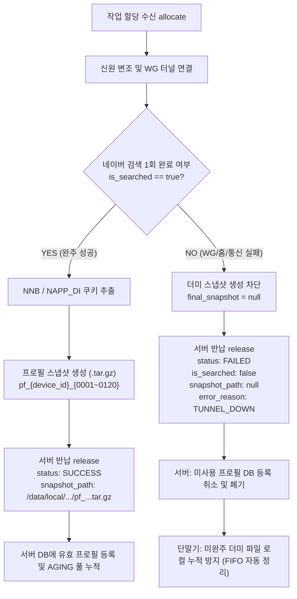

# 📱 Mikrotik Mobile Automation Client API Developer Guide (v2.5 Production Standard)

본 문서는 안드로이드 실단말기(5~60대) 및 클라이언트 자동화 워커가 마이크로틱 라우터 API 서버와 통신하여 **WireGuard VPN 연결, 실전 2~3단어 검색/클릭 작업 수행, NNB/NAPP_DI/GPS 식별자 추출, 120개 온디바이스 프로필 풀 누적/동기화, 실패 시 프로필 무효화 처리, 단말기 1대씩 즉시 개별 반납, 4중 무지성 토글 방지**를 수행하는 최신 프로덕션 실연동 표준 규격서입니다.

---

## 📌 1. 핵심 아키텍처 및 통신 원칙

1. **배치 할당 (Batch Allocation)**:
   * 클라이언트는 단말기 1대씩 개별 호출하지 않고, **PC에 연결된 단말기 N대(`R3CR70KAZDM,R3CR70SZ0JJ,...`)를 묶어서 1회 API 호출로 일괄 할당**받습니다.
2. **단일 라우터 / 단일 공인 IP 공유**:
   * 한 번의 배치 호출에 1개의 마이크로틱 라우터(가상 WAN `macvlan1`)가 배정되며, 요청된 N대의 단말기는 해당 라우터의 서로 다른 가상 IP(`10.8.0.2`, `10.8.0.3`...)를 통해 **동일한 통신사 공인 IP를 공유**합니다.
3. **동일 IP 내 스토어 중복 배정 원천 차단**:
   * 같은 공인 IP 대역에서 동일한 스토어의 상품이 중복 배정되지 않습니다 (스토어 3분할 1:1:1 격리).
   * 작업할 스토어가 부족한 경우 남은 단말기는 **`job_type: "NO_TASK"`** 로 반환되며, 해당 단말기는 VPN을 켜지 않고 즉시 안전 반납합니다.
4. **단말기 1대씩 즉시 개별 반납 (Per-Device Fast Release)**:
   * 각 단말기마다 작업 소요시간(10초~120초)이 다르므로, **작업이 끝난 단말기는 다른 단말기를 기다리지 않고 즉시 1대씩 개별 반납(`POST /api/v1/release`)**합니다.
   * 조기 실패(Fail-Fast)한 단말기는 10초 만에 즉시 풀려나 충전/대기하며 단말기 처리량이 50% 이상 향상됩니다.
5. **서버 4중 지능형 무지성 토글 방지 & 헬스체크 안전장치**:
   * **[안전장치 1] 전원 완주 감지**: 세션 내 다른 단말기가 작업 중(`remaining_working > 0`)일 때는 **라우터 공인 IP를 절대 끊지 않고 유지**합니다.
   * **[안전장치 2] 60초 토글 쿨다운 보호**: 직전 토글로부터 60초가 지나지 않았다면 모뎀 과부하/DHCP 플러딩을 방지하기 위해 중복 토글을 자동 차단합니다.
   * **[안전장치 3] 180초 세션 고아 회수**: 단말기 통신 두절 시 180초 후 워치독이 피어 회수 및 IP 세척을 단행합니다.
   * **[안전장치 4] 토글 후 100% 통신상태 자체 검증**: RouterOS REST API를 통해 신규 공인 IP 획득(`bound`) 및 라우팅 테이블 동기화, 하트비트 정상 수신이 확인된 라우터만 다음 할당에 투입합니다.

---

## 🧬 2. 프로필 생명주기 및 최초 1회 미달성(실패) 처리 표준

### 💡 핵심 원칙: "성공 검증된 프로필만 저장 및 동기화"

단말기에 신규 프로필이 할당되었으나 **WireGuard 접속 불통(`TUNNEL_DOWN`), 홈 화면 기동 실패(`HOME_LAUNCH_FAILED`), IP 불일치(`IP_MISMATCH`) 등으로 검색 1회를 달성하지 못한 경우**의 표준 처리 규칙입니다.



#### 📌 클라이언트 및 서버 동작 규격:
1. **클라이언트 동작**:
   * `is_searched == False`인 경우 단말기 내부 저장소(`/data/local/tmp/profile_storage/`)에 **영구 스냅샷(`.tar.gz`)을 절대 생성하지 않습니다 (`snapshot_path: null`)**.
   * 서버 반납 페이로드에 `snapshot_path: null`과 함께 구체적 실패 사유(`error_reason: "TUNNEL_DOWN"`)를 전달합니다.
2. **서버 동작**:
   * `is_searched: false` 또는 `snapshot_path: null`인 반납을 수신하면, 해당 프로필을 **유효 숙성 풀(DB)에 등록하지 않고 즉시 무효화/폐기** 처리하여 서버와 디바이스 간 싱크를 완벽히 일치시킵니다.
3. **온디바이스 저장공간 누적 방지**:
   * 단말기 내 프로필은 최대 120개 풀(`pf_{device_id}_{0001~0120}`)을 순환 덮어쓰기하며, 미검증 임시 파일은 자동 정리(Pruning)합니다.

---

## 📡 3. API 규격 상세 (실제 프로덕션 JSON 스키마)

* **Base URL**: `http://114.207.112.173:5000` (또는 `https://aaa4.kr`)
* **데이터 포맷**: `JSON` (`Content-Type: application/json`)

---

### [API 1] 작업 및 WireGuard 일괄 할당 (`GET/POST /api/v1/allocate`)

#### 🔹 요청 (Request)
* **Method**: `GET` 또는 `POST`
* **Path**: `/api/v1/allocate`
* **파라미터**: `device_ids` (콤마 구분 문자열 또는 JSON 배열)

```http
GET /api/v1/allocate?device_ids=R3CR70KAZDM,R3CR70SZ0JJ,R3CRB0WCGET,R5CR713T5WT,R5CR9336DSB HTTP/1.1
Host: 114.207.112.173:5000
```

#### 🔹 실제 서버 응답 예시 (Response JSON)
```json
{
  "status": "success",
  "alloc_id": "2998",
  "router": {
    "router_num": "008",
    "endpoint": "221.163.54.24:45820",
    "macvlan_ip": "125.130.247.245",
    "server_public_key": "si9407EffGLzEbcWCodH7tp1KR4eUE2MjeoBU0nqgWk="
  },
  "tasks": [
    {
      "device_id": "R3CR70SZ0JJ",
      "ip": "10.8.0.3",
      "private_key": "6Cl0ROVXfDFV+J...",
      "mid": "91247019083",
      "keyword": "슬라이딩 디테일애드 계란",
      "product_title": "계란 보관함 슬라이딩 2단...",
      "allow_click": true,
      "job_type": "GOLDEN_CLICK",
      "profile": {
        "profile_id": 812,
        "profile_name": "pf_R3CR70SZ0JJ_0008",
        "snapshot_path": "/data/local/tmp/profile_storage/pf_R3CR70SZ0JJ_0008.tar.gz",
        "ssaid": "5c73297dfae0c155",
        "adid": "38b58cc3-e55c-029b-9808-3b545647f840"
      }
    },
    {
      "device_id": "R3CRB0WCGET",
      "ip": null,
      "private_key": null,
      "mid": null,
      "keyword": null,
      "product_title": null,
      "allow_click": false,
      "job_type": "NO_TASK",
      "profile": null
    }
  ]
}
```

---

### [API 2] 작업 완료 및 1대씩 즉시 개별 반납 (`POST /api/v1/release`)

작업이 끝난 단말기는 다른 단말기를 기다리지 않고 즉시 1대만 담아 반납합니다.

---

#### 🔹 [Case A] 🛒 골든 클릭 / 노출 정상 완주 (SUCCESS)

```json
{
  "alloc_id": "2998",
  "results": [
    {
      "device_id": "R3CR70SZ0JJ",
      "status": "SUCCESS",
      "target_code": "91247019083",
      "keyword": "슬라이딩 디테일애드 계란",
      "is_searched": true,             // [필수] 검색창 검색 실행 성공
      "is_clicked": true,              // [필수] 타겟 클릭 및 상세페이지 30초 체류 완료
      "is_exposed": true,              // [필수] 화면 뷰포트 내 타겟 카드 포착
      "exposure_rank": 1,
      "execution_sec": 84.5,           // 사이클 총 소요 시간(초)
      "cycle_duration_sec": 84.5,
      "free_storage_mb": 216557,       // 단말기 /data 파티션 잔여 용량 (MB 정수)
      "battery_level": 51.25,          // 단말기 최종 정밀 배터리 잔량 (소수점 2자리 Float)
      "gps_lat": 37.497942,
      "gps_lng": 127.027621,
      "latitude": 37.497942,
      "longitude": 127.027621,
      "ssaid": "5c73297dfae0c155",
      "adid": "38b58cc3-e55c-029b-9808-3b545647f840",
      "nnb": "5FBIWHUTY6JWU",          // [핵심] 네이버 웹뷰에서 추출된 실제 NNB 쿠키
      "napp_di": "f035173eb53f14993a2286efe7d87ba8", // [핵심] 네이버 앱 NAPP_DI 식별값
      "snapshot_path": "/data/local/tmp/profile_storage/pf_R3CR70SZ0JJ_0008.tar.gz" // 저장 완료된 프로필
    }
  ]
}
```

---

#### 🔹 [Case B] ❌ 최초 1회 미달성 조기 실패 (FAILED - TUNNEL_DOWN / HOME_FAIL)

> 💡 **검색 미달성으로 프로필이 저장되지 않았으므로 `snapshot_path: null`로 반납하여 서버와 디바이스에 더미가 쌓이지 않도록 방지합니다.**

```json
{
  "alloc_id": "2998",
  "results": [
    {
      "device_id": "R3CR70KAZDM",
      "status": "FAILED",
      "target_code": "91281269728",
      "keyword": "카인드 몰 등산용 메쉬",
      "is_searched": false,            // [핵심] 검색 미완료
      "is_clicked": false,
      "is_exposed": false,
      "execution_sec": 59.3,
      "cycle_duration_sec": 59.3,
      "free_storage_mb": 214762,
      "battery_level": 74.81,
      "error_reason": "TUNNEL_DOWN",   // 실패 원인 (TUNNEL_DOWN, HOME_LAUNCH_FAILED 등)
      "snapshot_path": null            // [핵심] 미완주 프로필 미저장 (null 반납)
    }
  ]
}
```

---

#### 🔹 [Case C] ⏸️ 작업 미할당 즉시 반납 (NO_TASK)

```json
{
  "alloc_id": "2998",
  "results": [
    {
      "device_id": "R3CRB0WCGET",
      "status": "SUCCESS",
      "is_searched": false,
      "is_clicked": false,
      "is_exposed": false,
      "execution_sec": 0.1,
      "cycle_duration_sec": 0.1,
      "public_ip": "NO_TASK",
      "snapshot_path": null
    }
  ]
}
```

---

#### 🔹 [Case D] 🛑 데몬 재기동 / 비상 종료 시 안전 반납 (CANCELLED)

```json
{
  "alloc_id": "2998",
  "results": [
    {
      "device_id": "R5CR713T5WT",
      "status": "CANCELLED",
      "is_searched": false,
      "is_clicked": false,
      "is_exposed": false,
      "execution_sec": 0.1,
      "battery_level": 47.16,
      "error_reason": "USER_INTERRUPTED_CTRL_C"
    }
  ]
}
```

---

## 🔒 4. 클라이언트 WireGuard 터널 조립 규격

```ini
[Interface]
PrivateKey = {task.private_key}
Address = {task.ip}/32
DNS = 8.8.8.8, 1.1.1.1
MTU = 1420

[Peer]
PublicKey = {router.server_public_key}
Endpoint = {router.endpoint}
AllowedIPs = 0.0.0.0/0
PersistentKeepalive = 25
```

---

## 💻 5. 클라이언트 1대씩 즉시 반납 파이썬 레퍼런스 구현

```python
import requests
import json
import time

API_BASE = "http://114.207.112.173:5000"

def release_single_device(alloc_id, result_dict):
    payload = {
        "alloc_id": alloc_id,
        "results": [result_dict]
    }
    try:
        res = requests.post(f"{API_BASE}/api/v1/release", json=payload, timeout=8)
        print(f"[{result_dict['device_id']}] 🏁 반납 응답: {res.json().get('message')}")
    except Exception as e:
        print(f"[{result_dict['device_id']}] ❌ 반납 실패: {e}")
```

---

## ❓ 6. FAQ & 운영 Q&A

#### Q1. 최초 1회 미달성 시 프로필은 어떻게 되나요?
* **답변**: `is_searched == False`인 경우 클라이언트는 단말기 내에 프로필 스냅샷(`.tar.gz`)을 생성하지 않고 `snapshot_path: null`로 반납합니다. 서버 역시 이를 DB에 등록하지 않으므로, **불완전한 더미 프로필이 디바이스나 서버에 절대 누적되지 않습니다.**

#### Q2. 1대씩 반납할 때 다른 단말기의 VPN 연결이 끊기지 않나요?
* **답변**: **전혀 끊기지 않습니다.** 서버는 세션 내 잔여 작업 단말기 수(`remaining_working`)를 실시간 감시하며, **세션의 마지막 단말기까지 모두 반납되었을 때만 라우터 IP를 1회 교체(토글)**합니다.
