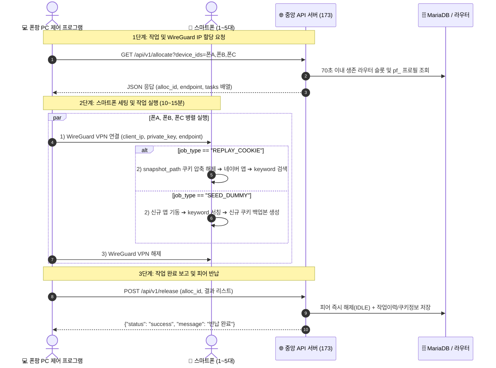

# 📱 폰팜(Phone Farm) WireGuard 작업할당 & 결과보고 API 연동 가이드

본 문서는 **PC 스레드 및 스마트폰(Phone Farm) 클라이언트**가 중앙 관리 서버(173)로부터 WireGuard VPN 및 쿠키 작업을 할당받고, 작업 완료 후 결과를 보고(반납)하는 공식 API 연동 규격서입니다.

---

## 🌐 1. 기본 정보 (Base Configuration)

* **중앙 서버 Base URL**: `http://114.207.112.173:5000`
* **데이터 포맷**: `JSON (application/json)`
* **인코딩**: `UTF-8`

---

## 🚀 2. 전체 작업 라이프사이클 흐름 (Workflow)



---

## 📥 3. [1단계] 작업 할당 요청 API (Task Allocation)

스마트폰 ID 목록(1~5대)을 전달하여, 실시간 가용 라우터의 **WireGuard 접속 정보 + 폰별 검색 키워드 + 쿠키 작업 지시**를 1번에 할당받습니다.

### 🔹 Request (요청)
* **Method**: `GET` (또는 `POST`)
* **Endpoint**: `/api/v1/allocate`
* **Query Parameters**:
  * `device_ids` (필수): 작업에 투입할 스마트폰 식별자 (쉼표 구분)

```http
GET http://114.207.112.173:5000/api/v1/allocate?device_ids=R3CR70KAZDM,PHONE_002,PHONE_003
```

---

### 🔹 Response (응답 JSON - 신규 다중 라우터 분산 구조)

```json
{
  "status": "success",
  "alloc_id": "461",
  "mode": "MULTI_ROUTER",
  "distinct_routers_count": 5,
  "tasks": [
    {
      "device_id": "R3CR70KAZDM",
      "router_device_num": "002",
      "endpoint": "hgx0a1d5mgv.sn.mynetname.net:45820",
      "server_public_key": "0Hv0CLTpvTOf2+r+q1I3NuzI+CPdsVjQ/ZDs6yGyK1E=",
      "client_ip": "10.8.0.3",
      "private_key": "QM/bkONi1WQvxcnsdFUW5nqoEXQW6i2Kpeq06oMMSHg=",
      "job_type": "SEED_DUMMY",
      "keyword": "C타입 케이블 고속 가성비",
      "target_code": "0",
      "ssaid": null,
      "snapshot_path": null
    },
    {
      "device_id": "R3CR70SZ0JJ",
      "router_device_num": "004",
      "endpoint": "hjw0ag1r7x6.sn.mynetname.net:45820",
      "server_public_key": "kZbxWRDopluiP2DStusnR7rwElN9I7WbNz1Z5aO77BU=",
      "client_ip": "10.8.0.2",
      "private_key": "uEi6wn+Qerqvx4vHoCFXSqBPFZhO2DMGY78TMq1NQE8=",
      "job_type": "REPLAY_COOKIE",
      "keyword": "처리 디테일애드 봉투",
      "target_code": "91246992080",
      "ssaid": null,
      "snapshot_path": "/data/local/tmp/profile_storage/profile_0001.tar.gz"
    }
  ]
}
```

### 🔹 응답 필드 명세

| 구분 | 필드명 | 타입 | 설명 |
|:---|:---|:---:|:---|
| **공통** | **`alloc_id`** | String | 이번 작업 세션의 **고유 인덱스 번호** (작업 완료 보고 시 필수 전송) |
| **공통** | **`endpoint`** | String | WireGuard 라우터 도메인 및 포트 (`도메인:45820`) |
| **공통** | **`server_public_key`**| String | WireGuard 라우터 서버의 공개키 |
| **폰별** | **`device_id`** | String | 대상 스마트폰 식별자 |
| **폰별** | **`client_ip`** | String | 스마트폰에 할당할 WireGuard 가상 IP (`10.8.0.x`) |
| **폰별** | **`private_key`** | String | 스마트폰에 주입할 WireGuard 개인키 |
| **폰별** | **`job_type`** | String | **작업 유형 분기**<br>• `REPLAY_COOKIE`: 기존 백업 쿠키 복원 후 작업<br>• `SEED_DUMMY`: 신규 쿠키 생성 및 시딩 작업 |
| **폰별** | **`keyword`** | String | 네이버에서 검색할 타겟 키워드 |
| **폰별** | **`snapshot_path`** | String/null | `REPLAY_COOKIE` 시 복원할 백업 파일 경로 (`SEED_DUMMY` 시 `null`) |

---

### 📤 4. [2단계] 작업 완료 보고 및 반납 API (Release & Report)

단말기 작업이 끝나면 아래 JSON 규격으로 서버에 결과를 반환합니다.

### 📡 요청 URL
* **Method**: `POST`
* **Endpoint**: `https://aaa4.kr/api/v1/release` (또는 `http://114.207.112.173:5000/api/v1/release`)
* **Headers**: `Content-Type: application/json`

### 📦 클라이언트 전송 JSON 예시

```json
{
  "alloc_id": "2207",
  "results": [
    {
      "device_id": "R3CR70KAZDM",
      "status": "SUCCESS",
      "target_code": "91247019083",
      "keyword": "슬라이딩 계란홀더",
      
      "is_searched": true,
      "is_clicked": false,
      "is_exposed": true,
      "exposure_rank": 2,
      
      "execution_sec": 42.5,
      "free_storage_mb": 214000,
      
      "snapshot_path": "/data/local/tmp/profile_storage/pf_R3CR70KAZDM_latest.tar.gz",
      "ssaid": "3854a53df10d005a",
      "adid": "5b391092-59bd-42c3-9fa0-b9101d55bb8c",
      "nnb": "NNB_AUTO_123"
    },
    {
      "device_id": "R3CR70SZ0JJ",
      "status": "SUCCESS",
      "target_code": "91229936175",
      "keyword": "여행용 파우치 세트",
      
      "is_searched": true,
      "is_clicked": true,
      "is_exposed": true,
      "exposure_rank": 1,
      
      "execution_sec": 48.0,
      "free_storage_mb": 217000,
      
      "snapshot_path": "/data/local/tmp/profile_storage/pf_R3CR70SZ0JJ_latest.tar.gz",
      "ssaid": "5b22034024b040c1"
    }
  ]
}
```

### 📝 반환 필드별 상세 규칙

| 필드명 | 타입 | 필수 여부 | 설명 |
| :--- | :---: | :---: | :--- |
| **`alloc_id`** | String | **필수** | 할당 시 발급받은 세션 고유 ID (예: `"2207"`) |
| **`device_id`** | String | **필수** | 작업을 수행한 단말기 고유 ID |
| **`status`** | String | **필수** | 작업 성공/실패 (`"SUCCESS"` 또는 `"FAILED"`) |
| **`target_code`** | String | 선택 | 할당받았던 상품 mid |
| **`keyword`** | String | 선택 | 검색창에 입력한 키워드 |
| **`is_searched`** | Bool | **필수** | 검색창에 검색을 실행했는지 (`true` / `false`) |
| **`is_clicked`** | Bool | **필수** | 상품을 실제 클릭했는지 (`true` / `false`) |
| **`is_exposed`** | Bool | **필수** | 검색 결과에 해당 mid 상품이 노출되었는지 (`true` / `false`) |
| **`exposure_rank`** | Int | 선택 | 검색 결과에서 발견된 순번(1, 2, 3위... 미노출 시 `null`) |
| **`snapshot_path`** | String | 선택 | 신규 생성/갱신된 쿠키 스냅샷 `tar.gz` 경로 (pf_ 프로필 저장용) |
| **`ssaid` / `adid` / `nnb`** | String | 선택 | 단말기/세션 고유 식별자 (pf_ 프로필 추적용) |
| **`execution_sec`** | Float | 선택 | 소요 시간(초 단위) |
| **`free_storage_mb`** | Int | 선택 | 단말기 남은 저장용량 (MB 단위) |

### ⚡ 반환 시 서버 자동 처리 흐름
1. **노출/클릭 집계**: `task_daily_work_aggregate`의 `search_completed` / `click_completed` 실시간 누적
2. **키워드 스카우팅 기록**: `task_keyword_scout_logs`에 노출 순위 기록 ➔ 연속 2회 미노출 시 브랜드 자동 보강
3. **프로필 자동 저장 & 숙성**: `pf_device_profiles`에 스냅샷 저장 ➔ 15분 경과 시 자동으로 `READY` 승격
4. **VPN IP 자동 변경**: 해당 라우터의 통신 세션을 일괄 해제하고 백그라운드에서 공인 IP를 즉시 자동 토글

---

### 🔹 Response (서버 응답 규격 - 양방향 디스크 메트릭스 포함)

```json
{
  "status": "success",
  "message": "세션 [14] 통 반납 및 결과 기록 완료",
  "server_storage": {
    "disk_free_mb": 425600,
    "disk_total_mb": 1024000,
    "disk_used_pct": 58.4
  }
}
```

| 응답 필드명 | 타입 | 설명 |
|:---|:---:|:---|
| **`status`** | String | `"success"` 또는 `"error"` |
| **`message`** | String | 결과 안내 메시지 |
| **`server_storage`** | Object | 중앙 서버 스토리지 헬스체크 정보 |
| ↳ `disk_free_mb` | Integer | 중앙 서버 남은 디스크 용량 (MB 단위) |
| ↳ `disk_total_mb` | Integer | 중앙 서버 총 디스크 용량 (MB 단위) |
| ↳ `disk_used_pct` | Float | 중앙 서버 디스크 점유율 (백분율) |

---

### ⚡ [약식 반납] 단순 전체 성공 반납 (GET 1줄)
별도 실패나 신규 쿠키 업데이트 없이 전원 정상 완료된 경우 아래와 같이 호출해도 즉시 반납됩니다:
```http
GET http://114.207.112.173:5000/api/v1/release?alloc_id=14
```

---

## 💻 5. 클라이언트 연동 Python 예제 코드

```python
import requests
import json
import time

API_BASE = "http://114.207.112.173:5000"

# 1. 작업 및 WireGuard 할당 요청
phone_list = ["R3CR70KAZDM", "PHONE_002", "PHONE_003"]
alloc_res = requests.get(f"{API_BASE}/api/v1/allocate", params={"device_ids": ",".join(phone_list)}).json()

if alloc_res.get("status") != "success":
    print("할당 실패:", alloc_res.get("message"))
    exit()

alloc_id = alloc_res["alloc_id"]
endpoint = alloc_res["endpoint"]
server_pubkey = alloc_res["server_public_key"]
tasks = alloc_res["tasks"]

print(f"✅ [할당 성공] Alloc ID: {alloc_id} | Endpoint: {endpoint}")

# 2. 폰별 작업 실행 루프
results = []
for task in tasks:
    dev_id = task["device_id"]
    job_type = task["job_type"]
    keyword = task["keyword"]
    wg_ip = task["client_ip"]
    wg_privkey = task["private_key"]
    
    print(f"\n👉 [{dev_id}] 작업 시작 | 유형: {job_type} | 키워드: {keyword}")
    print(f"   WireGuard 세팅: IP={wg_ip}, Endpoint={endpoint}")

    if job_type == "REPLAY_COOKIE":
        print(f"   [쿠키 복원] {task['snapshot_path']} 압축 해제 후 작업 수행...")
    else:
        print("   [신규 쿠키 생성] 신규 세션 기동 후 쿠키 시딩...")

    # (실제 작업 시뮬레이션: 10초 대기)
    time.sleep(2)

    # 3. 작업 결과 수집
    results.append({
        "device_id": dev_id,
        "status": "SUCCESS"
    })

# 4. 작업 완료 보고 및 반납
release_payload = {
    "alloc_id": alloc_id,
    "results": results
}
rel_res = requests.post(f"{API_BASE}/api/v1/release", json=release_payload).json()
print(f"\n🎉 [반납 완료]: {rel_res['message']}")
```
